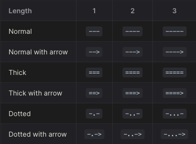

# [Flowchart](https://mermaid.js.org/syntax/flowchart.html)

- [形狀](https://mermaid.js.org/syntax/flowchart.html#node-shapes)

  - 語法範例
    ```text
      flowchart
        id1[id1]
        id2[(id2)]
        id3((id3))
        id4>id4]
        id5{id5}
        id6{{id6}}
        id7[/id7/]
        id8[\id8\]
        id9[/id9\]
        id10[\id10/]
        id11(((id11)))
        id12[[id12]]
        id13([id13])
    ```

  - 呈現範例
    ```mermaid
      flowchart
        id1[id1]
        id2[(id2)]
        id3((id3))
        id4>id4]
        id5{id5}
        id6{{id6}}
        id7[/id7/]
        id8[\id8\]
        id9[/id9\]
        id10[\id10/]
        id11(((id11)))
        id12[[id12]]
        id13([id13])
    ```
    
- [連線樣式](https://mermaid.js.org/syntax/flowchart.html#links-between-nodes)

  - 語法範例
    ```text
      flowchart LR
        1 --> 2
        2 --- 3
        3 -- something --- 4
        4 ---|like 3 to 4| 5
        5 -->|s2| 6
        6 -- like 5 to 6 --> 7
        8 -.-> 9
        9 -. s3 .-> 10
        10 ==> 11
        11 === 12
        12 == s4 ==> 13
        13 == s5 === 14
        15 --> 16 --> 17
        17 --> 18 & 19 --> 20
        20 --o 21
        21 --x 22
        23 o--o 24
        24 <--> 25
        25 x--x 26
      
        A & B --> C & D
    ```

  - 呈現範例
    ```mermaid
      flowchart LR
        1 --> 2
        2 --- 3
        3 -- something --- 4
        4 ---|like 3 to 4| 5
        5 -->|s2| 6
        6 -- like 5 to 6 --> 7
        8 -.-> 9
        9 -. s3 .-> 10
        10 ==> 11
        11 === 12
        12 == s4 ==> 13
        13 == s5 === 14
        15 --> 16 --> 17
        17 --> 18 & 19 --> 20
        20 --o 21
        21 --x 22
        23 o--o 24
        24 <--> 25
        25 x--x 26
      
        A & B --> C & D
    ```
    
- [連線長度如何控制](https://mermaid.js.org/syntax/flowchart.html#minimum-length-of-a-link)
    
  

- [子圖](https://mermaid.js.org/syntax/flowchart.html#subgraphs)

  - 語法範例
    ```text
    flowchart LR
    	A --> B
    	subgraph sg1
    	direction LR
    	B --> C
    	end
    
    	subgraph sg2
    	direction LR
    	C((C)) --o D
    	end
    
    	subgraph sg3
    	direction TB
    	E{E} --x F
    	end
    ```
  - 呈現範例
    ```mermaid
    flowchart LR
    	A --> B
    	subgraph sg1
    	direction LR
    	B --> C
    	end
    
    	subgraph sg2
    	direction LR
    	C((C)) --o D
    	end
    
    	subgraph sg3
    	direction TB
    	E{E} --x F
    	end
    ```
    
- [互動](https://mermaid.js.org/syntax/flowchart.html#interaction)

  - 語法範例
    ```text
    flowchart LR
    	A((Button))
    	B(tooltip)
    	%% 點擊後的打開方式支援 support _self, _blank, _parent and _top
    	click A "https://google.com" "tooltip" _blank
    	click B callback "show something"
    ```
  - 呈現範例
    ```mermaid
    flowchart LR
    	A((Button))
    	B(tooltip)
    	%% 點擊後的打開方式支援 support _self, _blank, _parent and _top
    	click A "https://google.com" "tooltip" _blank
    	click B callback "show something"
    ```
